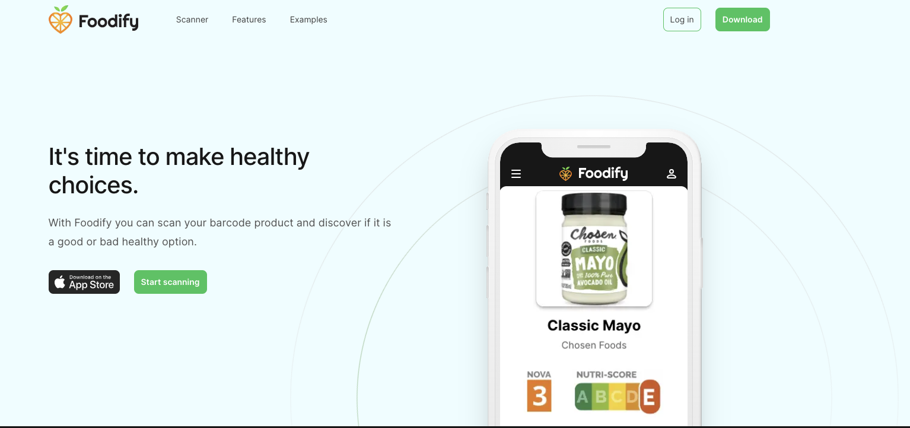
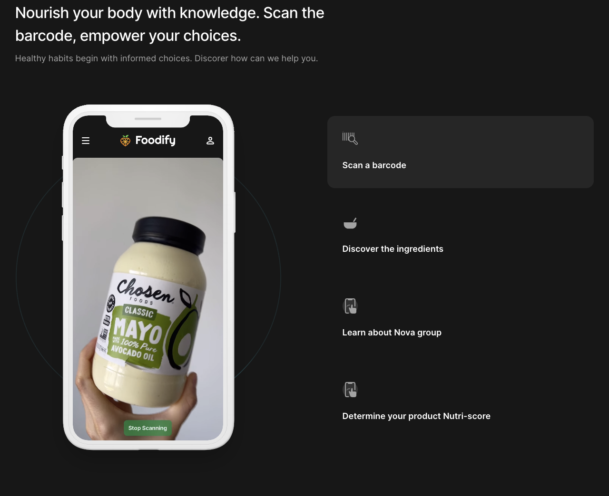
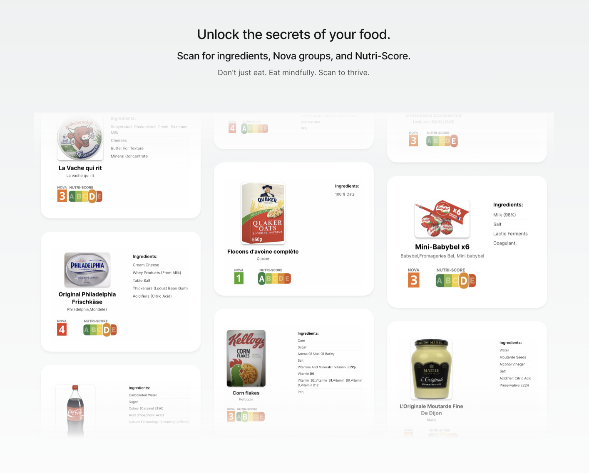
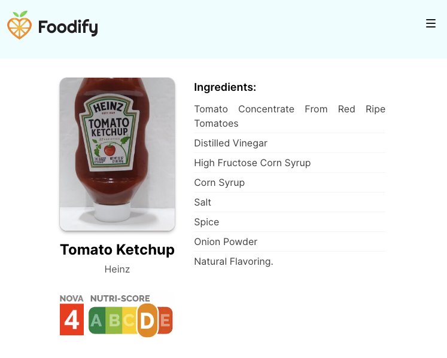
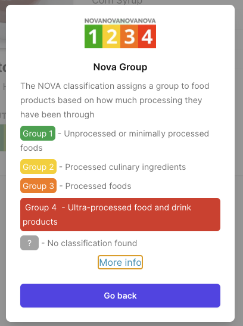
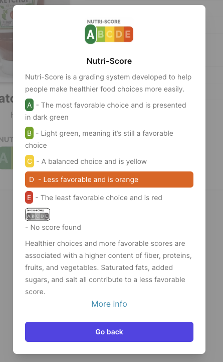

# Foodify

This is a capstone project, it is an app that can scan barcodes of food products and unisng an external API database can bring information to the user about the ingredients, nova group and nutricional score. This is made for people that want to be more conscious about what products they are consuming.

## Installation

This is a [Next.js](https://nextjs.org/) project bootstrapped with [`create-next-app`](https://github.com/vercel/next.js/tree/canary/packages/create-next-app).

## Getting Started

First, run the development server:

```bash
npm run dev
# or
yarn dev
# or
pnpm dev
```

Open [http://localhost:3000](http://localhost:3000) with your browser to see the result.

You can start editing the page by modifying `app/page.js`. The page auto-updates as you edit the file.

This project uses [`next/font`](https://nextjs.org/docs/basic-features/font-optimization) to automatically optimize and load Inter, a custom Google Font.

## Learn More

To learn more about Next.js, take a look at the following resources:

- [Next.js Documentation](https://nextjs.org/docs) - learn about Next.js features and API.
- [Learn Next.js](https://nextjs.org/learn) - an interactive Next.js tutorial.

You can check out [the Next.js GitHub repository](https://github.com/vercel/next.js/) - your feedback and contributions are welcome!

## Deploy on Vercel

The easiest way to deploy your Next.js app is to use the [Vercel Platform](https://vercel.com/new?utm_medium=default-template&filter=next.js&utm_source=create-next-app&utm_campaign=create-next-app-readme) from the creators of Next.js.

Check out our [Next.js deployment documentation](https://nextjs.org/docs/deployment) for more details.

## Tech Stack

Frontend
Next.js: A React framework for building server-rendered applications.
React: A JavaScript library for building user interfaces.
Tailwind CSS: A utility-first CSS framework for designing responsive web applications.
Framer Motion: A library for creating smooth animations in React applications.

Backend
Node.js: A JavaScript runtime for building server-side applications.
Express: A minimal and flexible Node.js web application framework.
@undecaf/barcode-detector-polyfill: A barcode detection polyfill library for browser compatibility.

Deployment and Hosting
Vercel: A cloud platform for hosting your Next.js applications, providing seamless deployment and scaling.

Version Control
Git and GitHub: Version control system and collaborative development platform.

Build and Development Tools
ESLint: A tool for identifying and fixing code errors and enforcing coding standards.
Webpack: A module bundler and task runner for bundling assets and optimizing the build.
copy-webpack-plugin: A Webpack plugin for copying individual files or entire directories to the build directory.

UI Components
@headlessui/react: A set of completely unstyled, fully accessible UI components for React.
@headlessui/tailwindcss: Tailwind CSS integration for Headless UI components.
@tailwindcss/forms: Plugin for styling form elements with Tailwind CSS.
clsx: A utility for conditionally joining class names together.

Other Dependencies
autoprefixer: A PostCSS plugin to parse CSS and add vendor prefixes.
postcss: A tool for transforming CSS with JavaScript.
use-debounce: A utility for debouncing functions.
zbar.wasm: A WebAssembly implementation of the ZBar barcode reader library.

## Features

-Real-time Barcode Detection: Instantly detect barcodes in images or video streams.

-User-Friendly Interface: A user-friendly web interface powered by React and Tailwind CSS.

-Cross-Platform Compatibility: Works on various devices and browsers thanks to Next.js.

-Smooth Animations: Enhance the user experience with smooth animations created using Framer Motion.

-Product Information Retrieval: Scan barcodes to fetch detailed information about products, including ingredients, nutritional score (Nutri-Score), and NOVA group classification.

-Ingredient Analysis: Provide users with a breakdown of product ingredients, helping them make informed choices about what they consume.

-Nutri-Score Display: Display the Nutri-Score of scanned products, offering a quick assessment of nutritional quality.

-NOVA Group Classification: Show the NOVA group classification to inform users about the level of food processing.

## API Reference

Open food facts API
`https://world.openfoodfacts.org/api/2/product/${upc}.json`;

# End-Point Description

GET /products/{barcode}

Response Format

```
{
"code": "5449000000439", "product": {
"_id": "5449000000439", "_keywords": [
"coca-cola",
]}}
```

## Screenshots








## Next steps

-User Accounts: Implement user account functionality to allow users to save their scanned products and preferences.

-Advanced Search: Enhance the product search capabilities with filters and sorting options.

## Lessons Learned

I learned that leaving the comfort zone and daring to implement new things that I did not have much experience with can lead to incredible and more efficient results. In this case using next.js and tailwind without having previous experience. I had problems with the first scan API I wanted to use, so I switched to use the standard barcode detector and using a polyfill when it is not supported by the browser.
